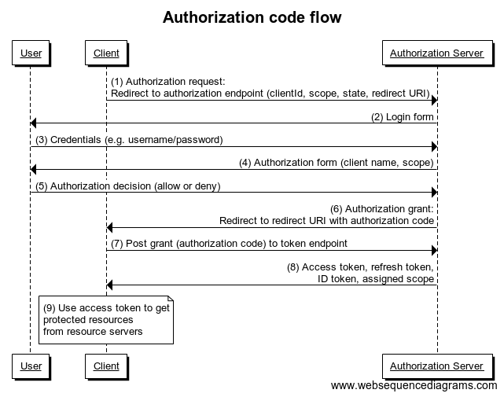
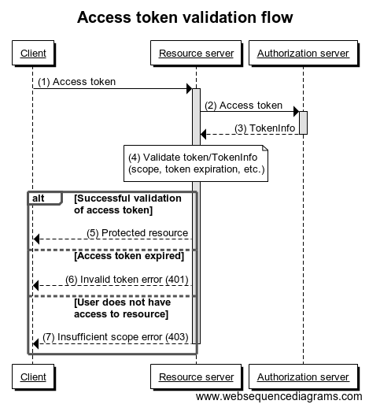

A service provider can use CONNECT ID for authenticating users and getting user consent
(authorization) in order to get access to their protected resources.
This will alleviate the need for the service provider to handle end user credentials,
by utilizing our signup processes and login mechanisms.
CONNECT ID supplies this functionality from an authorization server, which is implemented
according to the OAuth 2.0 and OpenID Connect protocols.

## Protocol flow

OAuth 2.0 and OpenID Connect define four roles:

-   __Resource owner__ - An entity capable of granting access to a protected resource, typically the end user.
-   __Client__ (aka __Relying Party__) - An application making protected resource requests on behalf of the resource owner and with its authorization.
-   __Resource server__ - A server hosting protected resources, capable of accepting  and responding to protected resource requests using access tokens.
-   __Authorization server__ (aka __OpenID Provider__) - The server issuing access tokens to the client after successfully authenticating the resource owner and obtaining authorization.

The above diagram shows how a client requests and gets an authorization grant from
the resource owner (1 and 2), exchanges the authorization grant for an access token (3 and 4),
and uses the access token to access protected resources (5 and 6).
An authorization grant is a credential representing the resource owner's authorization to access
its protected resources, which is used by the client to obtain an access token.
An access token is a credential used by the client when accessing protected resources
on resource servers.
The access token provides an abstraction layer and is much better to use than resource owner
credentials directly since it is usually opaque to the client and is typically restricted both
in lifetime and scope, which significantly improves security.

## Authorization code flow

The typical OAuth 2.0 / OpenID Connect flow is the authorization code flow.
In this flow, the client gets an authorization grant in the form of an abstract one-time usage
credential called an authorization code by involving the authorization server in
authenticating and getting authorization from the end user (resource owner).

The above diagram shows that the flow starts with directing the end user's browser to the
[/authorize](http://docs.telenordigital.com/apis/connect/id/authentication.html#authorization-server-user-authorization)
endpoint (1), where they are presented with a login/signup dialog (2).
After the user successfully logs in with their credentials (3) and authorizes access
(4 and 5), an authorization code is returned to the client via a browser redirect (6).
The client uses this authorization code to obtain tokens including the access token via the
[/token](http://docs.telenordigital.com/apis/connect/id/authentication.html#authorization-server-token) endpoint (7 and 8).
The client can use the access token to access protected resources on resource servers
as described in the previous section (9).

## Refresh token flow

An access token is for security reasons only valid for a limited amount of time
(in the order of several tenths of minutes).
In order to be able to maintain access for an extended amount of time without repeatedly
having to ask the resource owner for access, the client can use a refresh token to get
a new valid access token.

In the above diagram, a client is using the access token for some time until it expires,
which causes a resource server to return an invalid_token response (6).
When this happens, the client can use the refresh token to get a new valid access and refresh token
(7 and 8), see the [/token](http://docs.telenordigital.com/apis/connect/id/authentication.html#authorization-server-token)
endpoint for details about the request.
If the refresh token request fails as well, the client has lost its authorization and needs
to start the process over by requesting a new authorization grant from the resource owner.

In contrast to the access token, the refresh token is only used in communication between
the client and the authorization server, and is therefore less exposed to being compromised,
assuming that the client is able to store and handle refresh (and access) tokens securely.
Since the access token is valid just for a short while, an attacker will only have
a short period of time to crack and use an access token before it expires.

## Access token validation

For all requests to the end user's protected resources, the access token must be validated to
ensure that it has not expired and that its scope covers the requested resource, ref
[section 7 in the OAuth specification (RFC 6749)](https://tools.ietf.org/html/rfc6749#section-7).
Since the access tokens issued by CONNECT are so-called bearer tokens,
resource servers should be implemented according to the
[OAuth bearer token usage specification (RFC 6750)](https://tools.ietf.org/html/rfc6750).
All the resource servers provided by CONNECT are implemented according to this and are validating
access tokens, see documentation on [scope values and respective endpoints](authorization-and-authentication/scope.html).

Access to service-specific protected resources must be validated as well.
The best way of doing this is to put those resources on service-specific resource servers
accessible through RESTful calls using the access token as authentication according to
the OAuth bearer token usage specification mentioned above.
An alternative that might make sense for some confidential clients is to combine the client
and resource server into a single application.
If this is done, the access tokens must still be validated for all access to protected resources.
Please note that combining the client and resource servers into one unit might result in
modularisation issues and consequently make it harder to expand the functionality of the client if
such a need arises.

If the service-specific resource servers do not comply with validating access to protected
resources, functionality to revoke access for a client, e.g. when a mobile device for a user has
been stolen, will not work as intended, that is, keep the thief away from confidential data in the
clients.
This is not acceptable from an end user perspective.

Service-specific resource servers should define their own scope values that can be requested by
the clients and validated in the resource servers.
By default, when configuring clients in the authorization server, we will define
a single scope value per service that can and should be used for the purpose of
validating access tokens for service-specific resource servers.
This scope value will only be available for clients belonging to the service in question.
If your service has the need for more than a single service-specific scope value,
e.g. to be able to give access to different sets of resources for different clients,
please let us know, and we can define any number of custom scope values in the authorization server.

The above diagram shows how a client requests a protected resource from a resource server (1)
by providing the access token as a bearer token in the Authorization header.
The resource server looks up the access token via the
[/tokeninfo](http://docs.telenordigital.com/apis/connect/id/authentication.html#authorization-server-token-information) endpoint
(2), and the TokenInfo response (3) is used as a basis for token validation (4).
If the access token is valid and the scope is sufficient, the protected resource is returned (5).
Otherwise, an appropriate error response is returned (6 and 7).

## Maintaining a session in the client

In order to maintain access within the client using access and refresh tokens as described
in the sections above, the client needs to store at least the most recent access and refresh tokens
in a session.
As described in the previous section, the access token needs to be used in all requests to
protected resources.
If a resource server returns an invalid_token response, the access and refresh tokens
can be refreshed using the refresh token stored in the session.

The client may also choose to store the expires_in and scope fields from the token response
for the most recent access token and the time it was received in the session.
If the number of seconds indicated by the expires_in field has passed, the client can consider
refreshing the access token before trying to use it to avoid an unnecessary protected resource call
that will probably end up in an invalid_token response from the resource server.

We also recommend storing the [ID token](authorization-and-authentication/id-token.html) in the client-specific session.
The ID token contains useful information about the authentication and the end user which is
relevant for the session.
See examples of how this information can be used in the subsections below.

### Require different level of assurance for different parts of a client

The ID token contains information about the level of assurance (LoA) achieved in the user login
in the 'acr' claim and the client can also request that login should happen on a given LoA with
the 'acr_values' parameter for the
[authorization request](http://docs.telenordigital.com/apis/connect/id/authentication.html#authorization-server-user-authorization).

This can be used to protect sensitive functionality in the client by a higher LoA, while still
allowing smooth login on a lower LoA for functionality that is not as sensitive.
For instance, the client may request login on the default LoA (LoA 1) for the initial
authorization request when the client starts interacting with the client.
When the client accesses especially sensitive functionality, the client can check if the current
client-specific session contains an ID token with a high enough LoA, and if not, send
a new authorization request with a higher LoA (e.g. acr_value=2).
This will typically result in the user having to explicitly authenticate once more, but most users
will probably appreciate the extra security required when performing especially sensitive tasks
like changing profile data or performing a payment.

### Control the maximum age for the authentication

The ID token contains two useful timestamps: The time the ID token was issued (the 'iat' claim)
and the time of authentication (the 'auth_time' claim).
If the ID token was issued based on authentication through [single sign-on (SSO)](authorization-and-authentication/sso.html),
the time of authentication may be a long time before the issued time, while the timestamps
are typically the same if the ID token was issued based on an explicit user authentication.

The client may for security reasons choose to require that the authentication is not older than
a given value.
This can be achieved by checking the 'auth_time' claim in the ID token in the session.
The client may also force an authentication rather than automatic login through SSO by using
the 'max_age' parameter in the
[authorization request](http://docs.telenordigital.com//apis/connect/id/authentication.html#authorization-server-user-authorization).

Note that on LoA 1, the user might get automatic authentication through header enrichment.
To control this, e.g. turn off header enrichment for certain requests, the client may use
the 'prompt' parameter for the
[authorization request](http://docs.telenordigital.com//apis/connect/id/authentication.html#authorization-server-user-authorization).

Controlling the maximum age of the authentication might be especially useful in combination with
requiring higher LoA for sensitive functionality as described in the previous section.

## Back-channel logout

Some services might be concerned about their clients having to send a separate request to
the authorization server to [validate the access token](#access-token-validation)
for every access to service-specific protected resources.
They might for instance be concerned about the extra latency introduced by the
[/tokeninfo](http://docs.telenordigital.com//apis/connect/id/authentication.html#authorization-server-token-information)
request or the sheer number of requests.
Those clients may enable the back-channel logout feature by getting a client callback endpoint
for back-channel logout notifications configured in the authorization server.
Consequently, those clients will get a notification when a user is considered logged out
by the authorization server, rather than having to "poll" the /tokeninfo endpoint to detect
such a situation.
The notification will be in the form of a logout token, and the functionality is implemented
according to the
[OpenID Connect Back-Channel Logout spec](https://openid.net/specs/openid-connect-backchannel-1_0.html).

The logout token is a signed JWT, and just like the ID token, the signature can be validated and
contents can be decoded by passing it to the
[/tokeninfo](http://docs.telenordigital.com//apis/connect/id/authentication.html#authorization-server-token-information) endpoint.
Please note that this function is not supposed to be used in production because of
the extra network call.
In production, the client should get and cache the public keys for signing from the
[JWK set endpoint](http://docs.telenordigital.com//apis/connect/id/authentication.html#authorization-server-jwk-set-endpoint)
and a JWT library should be used to validate the signature and decode the logout token locally,
see [ID token validation](authorization-and-authentication/id-token.html#id-token-validation) for recommendations and links.

The set of claims contained in the logout token also needs to be validated by the client, see the
[OpenID Connect Back-Channel Logout spec, section 2.6](https://openid.net/specs/openid-connect-backchannel-1_0.html#Validation).
Depending on the configuration, the logout token contains enough information to identify either
the session the user is being logged out of (sub and sid claims) or the user being logged out
(just the sub claim).
The client must give a response according to
[OpenID Connect Back-Channel Logout spec, section 2.8](http://openid.net/specs/openid-connect-backchannel-1_0.html#BCResponse).

Note that the back-channel logout functionality is provided on a best-effort basis only, that is,
there are no guarantees that the client will be notified in all cases.
However, if a logout token is for example lost during transmission, the client will eventually
lose access when it tries to send a refresh token request, since the request will fail
because the refresh token has been revoked.

## Detailed authorization code flow

Below is a detailed authorization code flow diagram for OpenID Connect, which can be used
to get overview of relevant endpoints, parameters, and response data.

## Useful links

[CONNECT authentication and authorization API documentation](http://docs.telenordigital.com/apis/connect/id/authentication.html).
