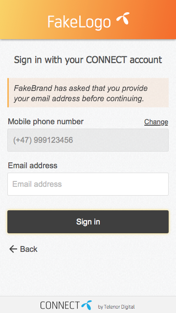

## What is CONNECT?
CONNECT is an easy and secure authentication and payment solution developed by Telenor (Digital). It contains sign in, payment* and account management flows.
CONNECT, by being open to all users, gives the ability to stay relevant in a user’s life even after they have churned from Telenor
Non-Telenor subscribers also have the ability to register and use CONNECT.

_CONNECT ID integration example_

### Basic principles

-   CONNECT is an HTML solution which is opened in a browser/in-app browser tab. This ensures:
    -   Consistent UX between services that use CONNECT
    -   SSO capabilities
    -   Continuous improvements
    -   Security
    -   Easy integration
-   A CONNECT account should be personal, i.e. belong to one user only
-   Login using phone number or email address
-   User can add multiple phone numbers and email addresses to the same CONNECT account
-   An email address or phone number can only be present on one account at a time
-   No relationship between CONNECT accounts

## Best practices

### General

Integrate CONNECT using a browser that supports Single Sign On

Single Sign On not only gives your users the advantage of not having to sign in to every single app which uses CONNECT; it also gives you instant access to My CONNECT account - Single Sign On

### Authentication

-   Use the CONNECT sign in button

Prime the user for the sign in flow which will be coming immediately after. This leads to less bounces and a higher conversion rate in the CONNECT flows.

Help the user recognise the Sign in across services using CONNECT, by using the same call to action button - CONNECT sign in button

-   Use the term “Sign in”

CONNECT is a single entry point solution where the user does not need to remember if they have an account (“Should I click login or register?”) - Terminology

-   Brand your flows

Help us to build trust towards the user, by choosing a header colour and logo which fits best with your starting screen - Branding capabilities

-   Choose high security levels only where needed

Lower security levels have a higher conversion rate (Telenor subscribers only). It is therefore a good idea to use lower security levels for fast on-boarding and low risk areas and only ask for a password before accessing more sensitive areas of your service - Various security levels

### Account management

-   Show “Signed in with” in your service

Give the user the opportunity to see what email/phone they have signed in with. As this is clearly related to “Sign in”, options to “Switch user”, “Manage CONNECT account” or to “Sign out” can be shown in this context. 
As an icon we suggest a person/cogwheel combined. Avoid using the cogwheel alone, as this is usually used for the app settings.

Show link only - small (link to an img)

-   Separate My CONNECT account-specific settings from App-specific settings

Make sure the user can easily differentiate between the settings in your app (e.g. turn off notifications, enable mobile data upload) from the My CONNECT account settings (e.g. change password, edit permissions, see connected services).
Show link only - small (link to an img)

## CONNECT features

### Single Sign On

To get the best cross-service experience and conversion rate, we recommend Single Sign On (SSO).

#### Benefits for the user
-   Instant access to all follow-up services on the same device, after having signed in to one service
-   Instant access to CONNECT’s account management (My CONNECT account)

#### Benefits for the service
-   Increase in conversions - no more bounces for follow-up services
-   Less issues with keeping user sessions, when pushing app updates

#### Benefits for the BUs
-   Increase in conversions among all services
-   Faster uptake for e-channels 
-   Faster uptake for new services

#### Requirements
For Single Sign On to work you have to do the following:
-   General
    Activate Single Sign On for your service
-   On mobile
    Integrate CONNECT by using an in-app browser tab like 
    -   Android - Chrome Custom Tabs
    -   iOS - Safari View Controller
-   On desktop
    User has to check “Stay signed in”

#### Example scenarios
SSO - Scenario 1
-   Services on LoA1 and no additional claims
-   First on mobile data
-   Follow up on Wifi or mobile data
-   SSO session not older than a specific age, set by follow up service
-   Existing CONNECT user

_First service on device (SSO session created)_

_Follow up services on same device (SSO session used)_

SSO - Scenario 2
-   Services on LoA2 and no additional claims
-   First on Wifi
-   Follow up on Wifi or mobile data
-   SSO session not older than a specific age, set by follow up service
-   Existing CONNECT user

_First service on device (SSO session created)_

_Follow up services on same device (SSO session used)_

Re-authentication
-   Follow up service on different LoA level, additional claims or with user prompt
-   First on Wifi
-   Follow up on Wifi or mobile data
-   SSO session not older than a specific age, set by follow up service
-   Existing CONNECT user

_First service on device (SSO session created)_

_Follow up services on same device (SSO session used)_

## Various security levels (Level of Assurance)

CONNECT offers 2 main security levels for your service. 
-   Mobile phone authentication (LoA1)
-   Password authentication (LoA2)
Different levels can be used for different areas of your service - more about Security
_All security levels work both on mobile data and on WiFi._

### Mobile phone authentication
With this security level the users get access when they are in possession of their phone. Depending on if the users phone is connected to the internet via mobile data or via WiFi, different flows apply.
-   On mobile data (Telenor subscribers only)*
    1.  Automatic detection of the phone number and automatic authentication of the user. No user interaction is required.
-   On WiFi (or mobile data for non-Telenor subscribers)*
    1.  The user has to provide the phone number.
    2.  A one time verification code is sent via SMS. 
    3.  The user has to enter the verification code.

´* with the Android SDK, automatic detection of the phone number can also be made available when the user is both on mobile data and on WiFi (webview only)

### Password authentication
For this authentication method the user needs to enter a password. As a user name both phone number and email address can be used. For this level of security the user flows on mobile data and on WiFi are very similar.

-   On mobile data (Telenor network)
    1.  Automatic detection of the phone number. 
    2.  Then the user has to provide only the password.
-   On WiFi (or mobile data on non-Telenor network)
    1.  The user has to first enter the phone number or email address. 
    2.  Then the user has to provide the password.

### Account management
My CONNECT account is used for all account administration purposes. Showing CONNECT account information within the service is possible, i.e. users can view CONNECT account information in the service. Editing of this information is done in My CONNECT account:
-   Change password
-   Edit phone numbers
-   Edit email addresses
-   Handling of Connected services
-   Link to overview screen / deep link to specific screen
-   Backlink

We encourage the services to provide an option to the user of managing these settings. 
Here are suggestions on how and where to provide this link, depending on how much screen estate is available.

### Show link only - small
Using “Signed in with <phone/email>” in combination with “Manage (CONNECT) account” has been proven to help users understand that CONNECT is related to the sign in. It also helps to differentiate between your app or other account settings.

### Show account data with link - large
With this option it is possible to show additional data from My CONNECT account (e.g. phone numbers, email addresses, password) and link directly to the screens where this data can be modified. 

## Other CONNECT features
### Branding and localisation capabilities
-   Customise your header by providing logo and header colour
-   Set a short message on the first screen of our flows
-   Available in 14 languages
    -   Bengali, Bulgarian, Burmese, Chinese Simplified, Danish, English, Indonesian, Malay, Montenegrin (Latin), Norwegian Bokmal, Serbian (Latin), Swedish, Thai, Urdu (Pakistan)

### Start screen customisation
-   Allow user to enter phone and e-mail, only phone or only e-mail.

-   Show phone or e-mail field first.

-   Pre-fill phone and/or e-mail.

### Flow customisation
-   Force the user to sign in with a specific phone or e-mail

-   Require the user to provide an e-mail address in addition to the phone

-   Force or disallow phone verification through SMS PIN roundtrip

### Session customisation
-   “Stay signed in”
    Show and set default value
    
-   Re-authentication
    

### Android and iOS SDKs for easy integration
-   Prevent automatic detection of phone numbers on mobile hotspots (Android)
-   Automatic detection of phone number when device is both on WiFi and mobile data (Android, webview only)
-   Automatic PIN code reading (Android, webview only)

### One entry point
-   CONNECT is a single entry point solution where the user does not need to remember if they have an account (“Should I click login or register?”)

### Security features
-   Password minimum character length: 6
-   Password strength indicator
-   Blocking common passwords
-   Rate limiting on password
-   Rate limiting on SMS
-   Notification on password change

## Integration details for sign in flows

### Native app

#### Entry point
-   CONNECT sign in button
    -   3 colour schemes (dark gray/light gray/blue)
    -   Localised language with clear call to action
    -   Assets available for Android, iOS and web (PNG, SVG, CSS)
        
-   On startup
    
-   Link 
    To reauthenticate or to go from one security level to the next.

### HTML flow integration
The recommended way of integrating CONNECT in a native app is to use an “in-app browser tab” like Chrome Custom Tabs on Android or Safari View Controller on iOS.

#### In-app browser tab
-   Single Sign On (SSO)
-   Autofilling of previously used phone number or email address
-   Use of Android/iOS/external password manager

_Android - Chrome Custom Tabs_

_iOS - Safari View Controller_

#### Webview
-   Automatic PIN code reading (Android, after user consent)
-   Automatic detection of phone number when device is both on WiFi and mobile data

### Browser app

#### Entry point
-   CONNECT sign in button
    -   3 colour schemes (dark gray/light gray/blue)
    -   Localised language with clear call to action
    -   Assets available for Android, iOS and web (PNG, SVG, CSS)
        
-   Link
    To reauthenticate or to go from one security level to the next.

#### Mobile
Redirect in same/new tab

#### Desktop
Pop-up in new tab
-   User stays in the context of your service by keeping the entry point in the background
-   Note: This is how Google and Facebook does it for 3rd parties
    

Redirect in same tab

### Session handling
-   On mobile
    How long a user is logged in after having signed in via CONNECT is handled by your service. A common “stay signed in” duration is 90 days, after which the user has to sign in again. Depending on the sensitivity of your data, this period can be made shorter or longer. 
    The mobile device is considered personal.
-   On desktop
    A desktop device is considered less personal. We therefore recommend to make use of our “Stay signed in” functionality. Signing in with the box unchecked will result in the user being signed out when the browser window is closed.
    -   Your service can decide if it should be checked or unchecked by default. 
    -   The users can decide if they want to stay signed in.
        _It is important that your service honours this decision._
        (img)

#### Session handling without SSO
Sign in
-   Stay signed in option visible AND not checked
	
-   Stay signed in option not visible OR checked
    
Sign out
-   Stay signed in option status irrelevant
    

#### Session handling with SSO
Possible on standalone browsers or in-app browser tab

Sign in
-   SSO active for both services | Stay signed in visible AND not checked
    
-   SSO active for service 1, SSO not active for service 2 | Stay signed not visible OR checked
    
-   SSO not active for service 1, SSO active for service 2 | Stay signed not visible OR checked
    
-   SSO active for one or both services | Stay signed in visible AND not checked
    

Sign out
-   SSO active for both services | Stay signed in visible AND not checked
    
-   SSO active for one or both services | Stay signed in visible AND not checked
    

### Terminology
This is a selection of terms to use on the service side for communication related to CONNECT. An extensive list can be found in our CONNECT translation playbook. 

Terms to use
-   Sign in / Sign out
    -   CONNECT is a single entry point solution where the user does not need to remember if they have an account (“Should I click login or register?”)
-   Signed in as (phone number/email)
    -   Use “signed in” as a way of telling the user what account he/she is using to connect.
-   Manage account / Manage CONNECT account
    -   Research shows that “manage account” is self explanatory for most users. The term account is also used when you “Sign in with your CONNECT account”. “Manage” is also a term that implies a form of action.
-   App settings
    -   “App settings” is a good way to distinguish settings related to the app, and settings related to the CONNECT account.
    -   In “App settings” you can for e.g. change notification settings or see app version.
-   Account settings
    -   If you need to group settings, you could use “account settings”. 
    -   To clearly help the user understand where information is stored, we suggest also using “account settings” when necessary.

Terms to avoid
-   Username
    -   As CONNECT does not operate with username, the term will be confusing for the users. Instead, directly use “email” or “phone number”.
-   Login/out
    -   Avoid terms like login / logout or logged in / out since “signed in” is established.

###UI Examples
Sign in with mobile phone authentication under different conditions.

Accessing a password secured area

Accessing My CONNECT account

### Try it out yourself
Create your custom flow
-   [Flow previewer](https://connect.staging.telenordigital.com/id/debug/flowPreviewer)

Other test flows 
-   Mobile phone authentication: [Hipstagram](http://hipstagram.telenordigital.com)
-   Password authentication: [All the news](http://allthenews.telenordigital.com)
-   Password authentication e-mail claim: [Strusic](http://strusic.telenordigital.com)

All test flows use our staging database and should not be relied on for availability.
