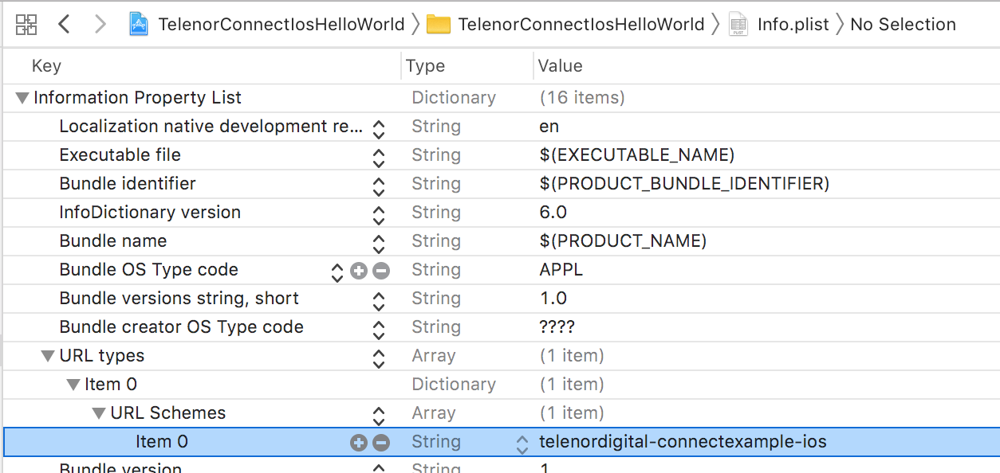

## Add dependency

Add `pod 'TDConnectIosSdk'` to your _Podfile_ and run `$ pod install`.

## Add URL Scheme to Info.plist


## Handle notification in AppDelegate

`AppDelegate.swift`
```swift
// ...
func application(_ app: UIApplication, open url: URL, options: [UIApplication.OpenURLOptionsKey : Any] = [:]) -> Bool {
    let notification = Notification(name: Notification.Name(rawValue: AGAppLaunchedWithURLNotification), object:nil, userInfo:[UIApplication.LaunchOptionsKey.url:url])
    NotificationCenter.default.post(notification)
    return true
}
```

## Add config and instantiate Oauth2Module

```swift
// We need an instance of Oauth2Module, and to get that we first need a config
let config = TelenorConnectConfig(clientId: "telenordigital-connectexample-ios",
    redirectUrl: "telenordigital-connectexample-ios://oauth2callback",
    useStaging: true,
    scopes: ["profile", "openid", "email"],
    accountId: "telenor-connect-ios-hello-world",
    webView: false,
    optionalParams: ["ui_locales": "no"])

// Instantiate oauth2Module
let oauth2Module = AccountManager.getAccountBy(config: config) ?? AccountManager.addAccountWith(config: self.config, moduleClass: TelenorConnectOAuth2Module.self)
```
